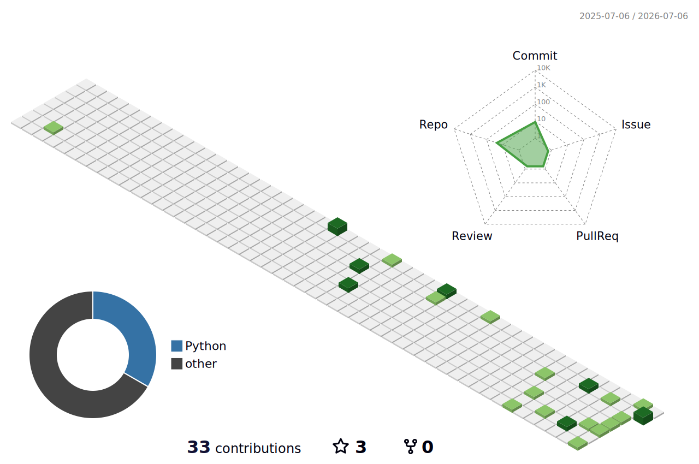

<div align="center">


<br/><br/>


<br/><br/>


<br/><br/>

<a href="mailto:yashodipptech@gmail.com">
  
</a>
<a href="https://www.linkedin.com/in/yashodip-borase/">
  
</a>
<a href="https://github.com/yashodipp">
  
</a>

<br/><br/>


</div>

---

<div align="center">


</div>

## About

I am building my career around data science, analytics, machine learning, and GenAI. My current learning path is aligned with a job-ready Data Science & Analytics with GenAI curriculum covering Python, statistics, NumPy, Pandas, data visualization, Excel, Power BI, SQL, machine learning, deep learning, generative AI, MLOps, and deployment.

My focus is simple: understand data deeply, clean and analyze it correctly, build useful dashboards, train machine learning models, and deploy AI-powered solutions that can support real decisions. I am shaping my GitHub profile around data roles instead of unrelated full-stack or generic software claims.

**Target Job Titles**

| Job Title | Matching Strength |
|---|---|
| Data Analyst | Python, Excel, SQL, dashboards, reporting, business insights |
| Business Intelligence Analyst | Power BI, KPI design, data visualization, stakeholder-ready dashboards |
| Junior Data Scientist | Statistics, EDA, feature engineering, ML modeling, evaluation |
| Machine Learning Engineer Intern | Model training, pipelines, deployment basics, MLOps foundations |
| GenAI Data Analyst | AI-assisted analytics, prompt workflows, LLM-powered insight generation |
| Data Science Intern | End-to-end data workflow from raw data to deployed analysis |

---

## Syllabus Alignment

<div align="center">

| Phase | Skill Area | Profile Direction |
|---|---|---|
| Phase 1 | Python Powerhouse | Python programming, data structures, scripting, automation |
| Phase 2 | Statistics That Matters | Probability, descriptive stats, inference, hypothesis thinking |
| Phase 3 | NumPy Ninjas | Numerical computing, arrays, vectorized analysis |
| Phase 4 | Pandas Playground | Data cleaning, wrangling, EDA, transformation |
| Phase 5 | Data Visualization | Matplotlib, Seaborn, Plotly, insight storytelling |
| Phase 6 | Excel Intelligence | Spreadsheets, formulas, reporting, business analysis |
| Phase 7 | Power BI Prodigy | BI dashboards, DAX basics, KPI reporting |
| Phase 8 | SQL | Queries, joins, aggregations, database analysis |
| Phase 9 | Machine Learning | Regression, classification, clustering, model evaluation |
| Phase 10 | Deep Learning | Neural networks and applied DL foundations |
| Phase 11 | Generative AI | LLM workflows, AI integration, GenAI-assisted analytics |
| Phase 12 | MLOps & Deployment | Model packaging, deployment, reproducible workflows |

</div>

---

## Skills

<div align="center">


<br/><br/>

<b>Core Data Stack</b>

<br/><br/>


<br/><br/>


</div>

---

## Data / AI Expertise

| Domain | Current Focus | Output I Build |
|---|---|---|
| Data Analysis | Python, Pandas, NumPy, Excel, SQL | Clean datasets, EDA notebooks, business summaries |
| BI & Reporting | Power BI, KPI logic, dashboard storytelling | Executive dashboards, reports, insight views |
| Statistics | Distributions, correlation, inference, hypothesis thinking | Data-backed conclusions and model reasoning |
| Machine Learning | Regression, classification, clustering, evaluation | Predictive models and model performance reports |
| Deep Learning | Neural network foundations and applied experimentation | DL-ready notebooks and learning projects |
| Generative AI | Prompting, LLM workflows, AI-assisted analytics | GenAI-powered analysis and assistant-style tools |
| MLOps & Deployment | Model packaging, reproducible setup, app deployment | Streamlit apps, model artifacts, deployment-ready projects |

---

## Portfolio Direction

<details open>
<summary><b>Data Analyst Track</b></summary>

<br/>

| Area | What I Focus On |
|---|---|
| Excel | Formulas, cleaning, summaries, analytical reporting |
| SQL | Joins, filters, aggregations, subqueries, business queries |
| Python | Data cleaning, transformation, EDA, automation |
| Visualization | Charts that explain trends, comparisons, outliers, and decisions |
| Power BI | Dashboards, KPIs, interactive analysis, business reporting |

</details>

<details>
<summary><b>Data Scientist / ML Track</b></summary>

<br/>

| Area | What I Focus On |
|---|---|
| Statistics | Understanding data behavior before modeling |
| Feature Engineering | Preparing better inputs for machine learning |
| ML Models | Regression, classification, clustering, evaluation |
| Deep Learning | Neural network fundamentals and experiments |
| Deployment | Packaging models into usable dashboards and apps |

</details>

<details>
<summary><b>GenAI + MLOps Track</b></summary>

<br/>

| Area | What I Focus On |
|---|---|
| GenAI | Prompt workflows, AI-assisted analytics, LLM-powered features |
| MLOps | Reproducible environments, artifact handling, deployment basics |
| Data Apps | Streamlit dashboards and model-backed user flows |
| Documentation | Clear READMEs, project explanation, recruiter-ready presentation |

</details>

---

## Experience

### Data Science & Analytics Learner | GenAI-Focused Portfolio
**2024 - Present**

Following a structured Data Science & Analytics with GenAI path and building portfolio projects around Python, statistics, data wrangling, visualization, BI dashboards, machine learning, deep learning, GenAI, MLOps, and deployment.

**Scope of Work**

- Clean and analyze datasets using Python, NumPy, Pandas, Excel, and SQL.
- Build visual reports and dashboards using Matplotlib, Seaborn, Plotly, Streamlit, and Power BI.
- Train and evaluate machine learning models for classification, regression, clustering, and business prediction use cases.
- Convert notebooks and model artifacts into polished dashboard applications.
- Document projects in a recruiter-friendly way with clear problem, workflow, result, and impact.

`Python` `Statistics` `NumPy` `Pandas` `Excel` `SQL` `Power BI` `Machine Learning` `GenAI` `MLOps`

### Machine Learning Project Builder | Applied Analytics Portfolio
**2023 - Present**

Built practical ML and analytics projects across healthcare, HR, country development analysis, clustering, and prediction dashboards. The goal is to show end-to-end data handling, modeling, visualization, and deployment readiness.

**Scope of Work**

- Perform exploratory data analysis and communicate insights through charts and summaries.
- Create model-backed dashboards with prediction forms, KPIs, analytics pages, and performance views.
- Package trained models with requirements, README documentation, and runnable app structure.
- Keep the portfolio aligned with data analyst, data scientist, BI analyst, ML intern, and GenAI analyst roles.

`EDA` `Data Visualization` `scikit-learn` `Streamlit` `Model Deployment` `Business Analytics`

---

## Achievements

<div align="center">

| Recognition | Details |
|---|---|
| Data Career Alignment | GitHub profile focused on Data Science, Analytics, ML, GenAI, and MLOps roles |
| Analytics Portfolio | Built dashboards and notebooks that explain data, predictions, KPIs, and model outcomes |
| ML Delivery | Converted datasets and trained models into usable prediction applications |
| BI Readiness | Building Excel, SQL, Power BI, and visualization skills for analyst roles |
| Deployment Mindset | Packaging projects with clean dependencies, model artifacts, and documentation |

</div>

---

## GitHub Analytics

<div align="center">


<br/><br/>


<br/><br/>


</div>

---

## GitHub Trophies

<div align="center">


</div>

---

## 3D Contribution View

<div align="center">



</div>

---

## Contribution Activity

<div align="center">


</div>

---

## Contribution Snake

<div align="center">

<picture>
  <source media="(prefers-color-scheme: dark)" srcset="https://raw.githubusercontent.com/yashodipp/yashodipp/output/github-contribution-grid-snake-dark.svg" />
  <source media="(prefers-color-scheme: light)" srcset="https://raw.githubusercontent.com/yashodipp/yashodipp/output/github-contribution-grid-snake.svg" />
  
</picture>

</div>

---

## Current Focus

```yaml
Learning:
  - Python for data science
  - Statistics for analytics
  - NumPy and Pandas
  - Excel and Power BI
  - SQL for business analysis
  - Machine learning and deep learning
  - Generative AI for analytics
  - MLOps and deployment

Building:
  - EDA notebooks
  - Power BI dashboards
  - SQL case studies
  - Machine learning dashboards
  - GenAI-powered analytics workflows
  - Deployment-ready data apps

Target Roles:
  - Data Analyst
  - Business Intelligence Analyst
  - Data Scientist Intern
  - Machine Learning Engineer Intern
  - GenAI Data Analyst
  - MLOps / ML Deployment Intern
```

---

## Connect

<div align="center">


<br/><br/>

<a href="mailto:yashodipptech@gmail.com">
  
</a>
<a href="https://www.linkedin.com/in/yashodip-borase/">
  
</a>
<a href="https://github.com/yashodipp">
  
</a>

</div>

---

<div align="center">

<b>Data tells the story. Analytics explains it. AI helps scale it.</b>

<br/><br/>


</div>
